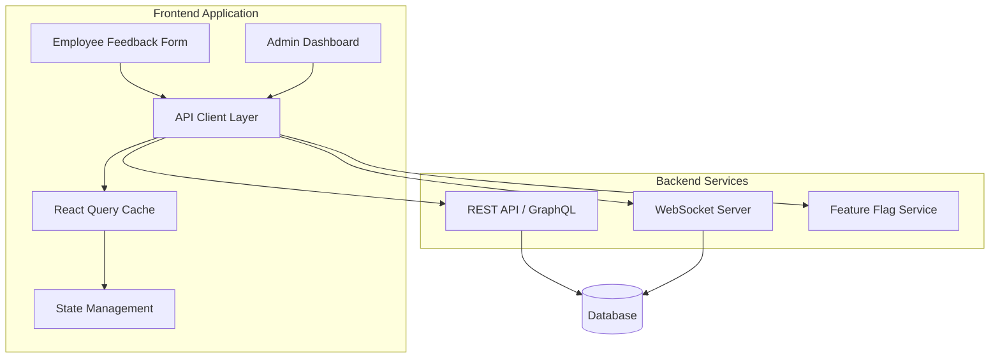
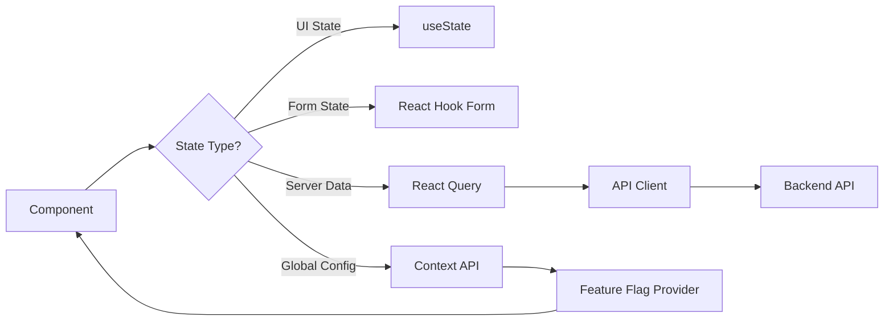

# Design Document

## Overview

The Driver Feedback & Sentiment Dashboard is a full-stack React application that provides two primary interfaces: a configurable employee feedback form and a real-time administrator analytics dashboard. The system is built with modern web technologies emphasizing performance, accessibility, and maintainability.

The application follows a component-based architecture with clear separation between presentation and business logic. It uses React with TypeScript for type safety, React Query for data fetching and caching, and Recharts for data visualization. The design prioritizes mobile-first responsive layouts, WCAG 2.1 AA accessibility compliance, and optimized performance metrics (LCP < 2.5s, CLS < 0.1).

## Architecture

### High-Level Architecture



### Technology Stack

- **Frontend Framework**: React 18 with TypeScript
- **State Management**: React Context API for global state, React Query for server state
- **Data Fetching**: React Query (TanStack Query) for caching, polling, and optimistic updates
- **Routing**: React Router v6
- **Styling**: Tailwind CSS for utility-first styling with custom design tokens
- **Charts**: Recharts for data visualization
- **Form Management**: React Hook Form with Zod validation
- **Testing**: Vitest + React Testing Library for unit tests, fast-check for property-based testing
- **Build Tool**: Vite for fast development and optimized production builds


## Components and Interfaces

### Component Hierarchy

```
App
├── FeedbackFormPage
│   ├── FeatureFlagProvider
│   ├── FeedbackForm
│   │   ├── EntityFeedbackSection (Driver, Trip, App, Marshal)
│   │   │   ├── StarRating
│   │   │   ├── TagChipGroup
│   │   │   └── TextAreaWithCounter
│   │   ├── ProgressIndicator
│   │   └── SubmitButton
│   └── SuccessToast
│
└── AdminDashboard
    ├── DashboardLayout
    │   ├── Sidebar
    │   ├── NotificationBell
    │   └── MainContent
    ├── OverviewPanel
    │   ├── MetricCard
    │   ├── DateRangePicker
    │   ├── SentimentDonutChart
    │   └── AlertCountBadge
    ├── DriverLeaderboard
    │   ├── SearchBar
    │   ├── SortableTable
    │   │   ├── DriverRow (expandable)
    │   │   └── ColorCodedCell
    │   └── Pagination
    ├── FeedbackTimeline
    │   ├── FilterPanel
    │   ├── VirtualizedList
    │   └── FeedbackCard
    └── DriverDetailPage
        ├── AlertBadge
        ├── TrendLineChart
        ├── TagFrequencyBarChart
        └── FeedbackHistoryTable
```

### Core Component Interfaces

#### FeedbackForm Component
```typescript
interface FeedbackFormProps {
  onSubmit: (data: FeedbackSubmission) => Promise<void>;
  isSubmitting: boolean;
}

interface FeedbackSubmission {
  entities: {
    driver?: EntityFeedback;
    trip?: EntityFeedback;
    app?: EntityFeedback;
    marshal?: EntityFeedback;
  };
  timestamp: Date;
}

interface EntityFeedback {
  rating: number; // 1-5
  tags: string[];
  comment?: string;
}
```

#### StarRating Component
```typescript
interface StarRatingProps {
  value: number;
  onChange: (rating: number) => void;
  disabled?: boolean;
  size?: 'small' | 'medium' | 'large';
  ariaLabel: string;
}
```

#### DriverLeaderboard Component
```typescript
interface DriverLeaderboardProps {
  dateRange: DateRange;
  onDriverClick: (driverId: string) => void;
}

interface DriverData {
  id: string;
  name: string;
  totalTrips: number;
  averageScore: number;
  trend: 'up' | 'down' | 'stable';
  trendPercentage: number;
  recentFeedback: FeedbackEntry[];
}

interface FeedbackEntry {
  id: string;
  entityType: 'driver' | 'trip' | 'app' | 'marshal';
  sentiment: 'positive' | 'neutral' | 'negative';
  score: number;
  timestamp: Date;
  comment?: string;
}
```


#### OverviewPanel Component
```typescript
interface OverviewPanelProps {
  dateRange: DateRange;
}

interface OverviewMetrics {
  totalFeedback: number;
  sentimentDistribution: {
    positive: number;
    neutral: number;
    negative: number;
  };
  averageScore: number;
  flaggedDriverCount: number;
}

interface DateRange {
  start: Date;
  end: Date;
  preset: 'today' | '7days' | '30days';
}
```

#### Feature Flag Configuration
```typescript
interface FeatureFlagConfig {
  driverFeedback: boolean;
  tripFeedback: boolean;
  appFeedback: boolean;
  marshalFeedback: boolean;
}

interface FeatureFlagContextValue {
  config: FeatureFlagConfig;
  isLoading: boolean;
  error: Error | null;
  refetch: () => Promise<void>;
}
```

## Data Models

### Feedback Submission Model
```typescript
interface FeedbackSubmissionPayload {
  employeeId: string;
  tripId: string;
  entities: {
    driver?: {
      driverId: string;
      rating: number;
      tags: string[];
      comment?: string;
    };
    trip?: {
      rating: number;
      tags: string[];
      comment?: string;
    };
    app?: {
      rating: number;
      tags: string[];
      comment?: string;
    };
    marshal?: {
      marshalId: string;
      rating: number;
      tags: string[];
      comment?: string;
    };
  };
  submittedAt: string; // ISO 8601
}
```

### Driver Analytics Model
```typescript
interface DriverAnalytics {
  driverId: string;
  name: string;
  totalTrips: number;
  averageScore: number;
  scoreHistory: ScoreDataPoint[];
  tagFrequency: Record<string, number>;
  feedbackHistory: FeedbackEntry[];
  isFlagged: boolean;
  trend: {
    direction: 'up' | 'down' | 'stable';
    percentage: number;
    comparisonPeriod: 'week' | 'month';
  };
}

interface ScoreDataPoint {
  date: string; // ISO 8601
  score: number;
  feedbackCount: number;
}
```

### Alert Model
```typescript
interface Alert {
  id: string;
  driverId: string;
  driverName: string;
  currentScore: number;
  threshold: number;
  triggeredAt: string; // ISO 8601
  isRead: boolean;
}
```


## Correctness Properties

*A property is a characteristic or behavior that should hold true across all valid executions of a system—essentially, a formal statement about what the system should do. Properties serve as the bridge between human-readable specifications and machine-verifiable correctness guarantees.*

### Property Reflection

After analyzing all acceptance criteria, several redundancies were identified:
- Properties 1.1, 4.2, and 4.4 all test feature flag configuration driving UI rendering - combined into Property 1
- Properties 6.2, 6.3, and 6.4 all test color classification based on score ranges - combined into Property 6
- Properties 7.3, 7.4, and 7.5 all test filtering functionality - combined into Property 11
- Properties 16.1, 16.2, 16.3, and 16.4 all test design system consistency - combined into Property 28

### Core Properties

Property 1: Feature flag configuration drives rendering
*For any* feature flag configuration object, the rendered feedback form should display exactly those entity sections where the flag is enabled, and no sections where the flag is disabled
**Validates: Requirements 1.1, 4.2, 4.4**

Property 2: Duplicate submission prevention
*For any* feedback submission, after the submit button is clicked once, subsequent clicks should not trigger additional submissions until the first submission completes
**Validates: Requirements 1.4**

Property 3: Required field validation on blur
*For any* required form field, when focus leaves the field while it is empty, an inline error message should appear immediately
**Validates: Requirements 2.1**

Property 4: Character count accuracy
*For any* text area input, the displayed character count should always equal the actual length of the text content
**Validates: Requirements 2.2**

Property 5: Error message clearing on correction
*For any* form field with a validation error, when the field value changes to become valid, the error message should be removed immediately
**Validates: Requirements 2.3**

Property 6: Color classification by score range
*For any* driver with an average score, the row color should be green if score ≥ 4.0, amber if 2.5 ≤ score < 4.0, and red if score < 2.5
**Validates: Requirements 6.2, 6.3, 6.4**

Property 7: Table sorting correctness
*For any* sortable column and sort direction, clicking the column header should reorder all rows such that values in that column are in ascending or descending order
**Validates: Requirements 6.5**

Property 8: Search filter accuracy
*For any* search term, the filtered driver list should contain only drivers whose name or ID contains the search term as a substring (case-insensitive)
**Validates: Requirements 6.6**

Property 9: Row expansion shows recent feedback
*For any* driver row that is clicked, the expanded view should display exactly the 5 most recent feedback entries for that driver, ordered by timestamp descending
**Validates: Requirements 6.7**

Property 10: Timeline entry completeness
*For any* feedback entry displayed in the timeline, the rendered output should include entity type, sentiment badge, score, timestamp, and truncated text
**Validates: Requirements 7.1**

Property 11: Filter result accuracy
*For any* combination of entity type, sentiment, and date range filters, the displayed feedback should include only entries that match all applied filter criteria
**Validates: Requirements 7.3, 7.4, 7.5**

Property 12: Tag frequency calculation
*For any* driver with feedback containing tags, the bar chart should display each unique tag with a frequency count equal to the number of times that tag appears in the driver's feedback history
**Validates: Requirements 8.3**

Property 13: Alert threshold triggering
*For any* driver whose average score drops below the configured alert threshold, a notification should be generated with the driver's name and current score
**Validates: Requirements 9.1**

Property 14: Unread alert count accuracy
*For any* set of alerts, the notification bell badge count should equal the number of alerts where isRead is false
**Validates: Requirements 9.2**

Property 15: Alert read state update
*For any* alert that is viewed by an administrator, the alert's isRead property should change from false to true, and the unread count should decrease by 1
**Validates: Requirements 9.5**

Property 16: Real-time update latency
*For any* new feedback submission, the dashboard metrics should reflect the new data within 5 seconds of submission
**Validates: Requirements 11.1**

Property 17: API error handling
*For any* failed API request, the UI should display a user-friendly error message and not crash or show raw error details
**Validates: Requirements 13.1**

Property 18: Empty state display
*For any* view where the data set is empty, the UI should display an appropriate empty state message rather than showing nothing or an error
**Validates: Requirements 13.3**

Property 19: Cache hit on repeated requests
*For any* data request that is made multiple times within the cache validity period, only the first request should result in an API call, and subsequent requests should be served from cache
**Validates: Requirements 14.1**

Property 20: Request deduplication
*For any* data endpoint, if multiple components request the same data concurrently, only a single API call should be made
**Validates: Requirements 14.3**

Property 21: Cache invalidation on mutation
*For any* data mutation (feedback submission), all cache entries that depend on the mutated data should be invalidated and refetched
**Validates: Requirements 14.4**

Property 22: Stale-while-revalidate behavior
*For any* previously visited view with cached data, navigating back should display the cached data immediately while triggering a background revalidation
**Validates: Requirements 14.5**

Property 23: Date range filtering
*For any* selected date range (today, 7 days, or 30 days), the displayed feedback count should include only feedback with timestamps within that range
**Validates: Requirements 5.1**

Property 24: Sentiment distribution calculation
*For any* set of feedback data, the sentiment distribution percentages should sum to 100%, with positive = count(score ≥ 4.0) / total, neutral = count(2.5 ≤ score < 4.0) / total, negative = count(score < 2.5) / total
**Validates: Requirements 5.2**

Property 25: Average score calculation
*For any* set of driver feedback, the displayed average score should equal the sum of all scores divided by the count of scores
**Validates: Requirements 5.3**

Property 26: Flagged driver count
*For any* set of drivers, the flagged driver count should equal the number of drivers whose average score is below the alert threshold
**Validates: Requirements 5.4**

Property 27: Driver detail data completeness
*For any* driver detail page, the displayed data should include name, ID, total trips, average score, trend indicator, 30-day score history, tag frequency breakdown, and paginated feedback history
**Validates: Requirements 6.1, 8.2, 8.4**

Property 28: Design system consistency
*For any* UI element, the applied colors, typography, and spacing values should match the defined design tokens and spacing scale
**Validates: Requirements 16.1, 16.2, 16.3, 16.4**

Property 29: Keyboard accessibility
*For any* interactive element, pressing Tab should move focus to that element, and the element should display a visible focus indicator
**Validates: Requirements 3.3**

Property 30: ARIA label presence
*For any* form control or interactive element, the rendered HTML should include appropriate ARIA attributes (aria-label, aria-labelledby, or aria-describedby)
**Validates: Requirements 3.4**

Property 31: Touch target minimum size
*For any* interactive element on mobile viewports, the tap target should have minimum dimensions of 44x44 pixels
**Validates: Requirements 3.1**

Property 32: Configuration reactivity
*For any* feature flag configuration change, the UI should update to reflect the new configuration without requiring a page reload
**Validates: Requirements 4.1**

Property 33: Navigation correctness
*For any* driver clicked in the leaderboard or alert list, the application should navigate to the driver detail page with the correct driver ID in the route
**Validates: Requirements 8.1, 9.4**

Property 34: Retry mechanism availability
*For any* failed network operation, the error UI should include a retry button that, when clicked, reattempts the failed operation
**Validates: Requirements 13.2**

Property 35: Recoverable error actions
*For any* recoverable error state, the error UI should provide clear action buttons that allow the user to resolve the issue
**Validates: Requirements 13.5**


## Error Handling

### Error Categories and Strategies

#### Network Errors
- **Detection**: Catch failed fetch requests, timeout errors, and connection refused errors
- **User Feedback**: Display toast notifications with clear error messages (e.g., "Unable to connect. Please check your internet connection.")
- **Recovery**: Provide retry buttons that reattempt the failed request
- **Implementation**: Use React Query's error handling with automatic retry logic (3 attempts with exponential backoff)

#### API Errors
- **4xx Errors**: Display user-friendly messages explaining what went wrong (e.g., "Invalid feedback submission. Please check your inputs.")
- **5xx Errors**: Display generic server error messages with retry options (e.g., "Server error. Please try again later.")
- **Implementation**: Map API error codes to user-friendly messages in an error dictionary

#### Validation Errors
- **Detection**: Validate form inputs on blur and before submission using Zod schemas
- **User Feedback**: Display inline error messages next to the invalid field
- **Recovery**: Clear error messages when the user corrects the input
- **Implementation**: Use React Hook Form's validation integration

#### Configuration Errors
- **Detection**: Handle missing or malformed feature flag configurations
- **User Feedback**: Display a warning banner if configuration cannot be loaded
- **Recovery**: Provide a retry button and fall back to default configuration (all flags disabled)
- **Implementation**: Use error boundaries and fallback values

#### Runtime Errors
- **Detection**: Use React Error Boundaries to catch unhandled exceptions
- **User Feedback**: Display a generic error page with a "Reload" button
- **Recovery**: Allow users to reload the page or navigate back
- **Logging**: Log error details to console and error tracking service (e.g., Sentry)

### Empty States

- **No Feedback Available**: Display message "No feedback has been submitted yet" with an illustration
- **No Search Results**: Display "No drivers match your search" with suggestions to adjust filters
- **No Alerts**: Display "No active alerts" with a checkmark icon
- **All Feature Flags Disabled**: Display "No feedback options available. Please contact your administrator."

### Loading States

- **Initial Page Load**: Display full-page skeleton loaders matching the layout structure
- **Data Fetching**: Display shimmer effects in metric cards and table rows
- **Form Submission**: Display spinner on submit button with "Submitting..." text
- **Infinite Scroll**: Display loading spinner at the bottom of the timeline
- **Chart Loading**: Display skeleton chart placeholders


## Testing Strategy

### Unit Testing

Unit tests will verify specific component behaviors, edge cases, and business logic functions using Vitest and React Testing Library.

**Component Testing Focus**:
- StarRating: Test rating selection, hover states, keyboard navigation, ARIA attributes
- TagChipGroup: Test tag selection/deselection, multiple selection, disabled states
- TextAreaWithCounter: Test character counting, max length enforcement, validation
- SortableTable: Test column sorting, search filtering, row expansion
- DateRangePicker: Test date selection, preset options, validation

**Business Logic Testing Focus**:
- Sentiment classification functions (score to sentiment mapping)
- Color classification logic (score to color mapping)
- Date range calculation utilities
- Tag frequency aggregation
- Average score calculation
- Filter and search algorithms

**Edge Cases to Cover**:
- Empty data sets (no feedback, no drivers, no alerts)
- Boundary values (scores of exactly 2.5, 4.0)
- Maximum character limits in text areas
- All feature flags disabled
- Single driver with no feedback
- Concurrent API requests

### Property-Based Testing

Property-based tests will verify universal properties using fast-check library. Each property test will run a minimum of 100 iterations with randomly generated inputs.

**Property Testing Library**: fast-check (JavaScript/TypeScript property-based testing library)

**Test Configuration**:
```typescript
import fc from 'fast-check';

// Each property test should run at least 100 iterations
fc.assert(
  fc.property(/* generators */, /* test function */),
  { numRuns: 100 }
);
```

**Tagging Convention**:
Each property-based test must include a comment tag in this exact format:
```typescript
// Feature: driver-feedback-dashboard, Property 1: Feature flag configuration drives rendering
```

**Key Properties to Test**:
- Property 1: Feature flag configuration drives rendering (generate random configs, verify correct sections render)
- Property 4: Character count accuracy (generate random text, verify count matches length)
- Property 6: Color classification by score range (generate random scores, verify correct color)
- Property 7: Table sorting correctness (generate random driver data, verify sort order)
- Property 8: Search filter accuracy (generate random drivers and search terms, verify results)
- Property 11: Filter result accuracy (generate random feedback and filters, verify filtered results)
- Property 12: Tag frequency calculation (generate random feedback with tags, verify counts)
- Property 19: Cache hit on repeated requests (generate random request sequences, verify cache behavior)
- Property 24: Sentiment distribution calculation (generate random feedback, verify percentages sum to 100%)
- Property 25: Average score calculation (generate random scores, verify average)

**Generators to Implement**:
- `arbFeatureFlagConfig`: Generates random feature flag configurations
- `arbFeedbackScore`: Generates scores between 1 and 5
- `arbDriverData`: Generates random driver objects with realistic data
- `arbFeedbackEntry`: Generates random feedback entries
- `arbDateRange`: Generates valid date ranges
- `arbSearchTerm`: Generates realistic search strings
- `arbTags`: Generates arrays of feedback tags

### Integration Testing

Integration tests will verify critical user flows work end-to-end:
- Complete feedback submission flow (form fill → validation → submission → success)
- Dashboard data loading and filtering flow
- Driver detail navigation and data display
- Alert generation and notification flow
- Real-time update propagation

### Accessibility Testing

Automated accessibility tests using @axe-core/react:
- Run axe accessibility scanner on all major views
- Verify ARIA attributes on interactive elements
- Test keyboard navigation flows
- Verify color contrast ratios
- Test screen reader compatibility

### Performance Testing

- Measure and assert LCP < 2.5s for dashboard initial load
- Measure and assert CLS < 0.1 for all views
- Test virtualized list performance with 1000+ items
- Verify view transition times < 200ms

### Test Organization

```
src/
├── components/
│   ├── StarRating/
│   │   ├── StarRating.tsx
│   │   ├── StarRating.test.tsx (unit tests)
│   │   └── StarRating.properties.test.tsx (property tests)
│   └── ...
├── utils/
│   ├── calculations.ts
│   ├── calculations.test.ts (unit tests)
│   └── calculations.properties.test.ts (property tests)
└── __tests__/
    ├── integration/
    │   └── feedback-submission.test.tsx
    └── generators/
        └── arbitraries.ts (fast-check generators)
```


## API Contracts

### Feedback Submission API

**Endpoint**: `POST /api/feedback`

**Request**:
```typescript
{
  employeeId: string;
  tripId: string;
  entities: {
    driver?: {
      driverId: string;
      rating: number; // 1-5
      tags: string[];
      comment?: string;
    };
    trip?: {
      rating: number;
      tags: string[];
      comment?: string;
    };
    app?: {
      rating: number;
      tags: string[];
      comment?: string;
    };
    marshal?: {
      marshalId: string;
      rating: number;
      tags: string[];
      comment?: string;
    };
  };
}
```

**Response** (201 Created):
```typescript
{
  id: string;
  submittedAt: string; // ISO 8601
  status: "success";
}
```

**Error Responses**:
- 400: Validation error (invalid rating, missing required fields)
- 409: Duplicate submission (feedback already exists for this trip)
- 500: Server error

### Feature Flag Configuration API

**Endpoint**: `GET /api/config/feature-flags`

**Response** (200 OK):
```typescript
{
  driverFeedback: boolean;
  tripFeedback: boolean;
  appFeedback: boolean;
  marshalFeedback: boolean;
  alertThreshold: number; // e.g., 2.5
}
```

### Dashboard Overview API

**Endpoint**: `GET /api/dashboard/overview?dateRange={preset}`

**Query Parameters**:
- `dateRange`: "today" | "7days" | "30days"

**Response** (200 OK):
```typescript
{
  totalFeedback: number;
  sentimentDistribution: {
    positive: number; // percentage
    neutral: number;
    negative: number;
  };
  averageScore: number;
  flaggedDriverCount: number;
}
```

### Driver Leaderboard API

**Endpoint**: `GET /api/dashboard/drivers?dateRange={preset}&search={term}&sortBy={column}&sortOrder={order}`

**Query Parameters**:
- `dateRange`: "today" | "7days" | "30days"
- `search`: string (optional)
- `sortBy`: "name" | "averageScore" | "totalTrips" (optional)
- `sortOrder`: "asc" | "desc" (optional)

**Response** (200 OK):
```typescript
{
  drivers: Array<{
    id: string;
    name: string;
    totalTrips: number;
    averageScore: number;
    trend: {
      direction: "up" | "down" | "stable";
      percentage: number;
    };
    isFlagged: boolean;
  }>;
  total: number;
}
```

### Driver Detail API

**Endpoint**: `GET /api/dashboard/drivers/{driverId}`

**Response** (200 OK):
```typescript
{
  id: string;
  name: string;
  totalTrips: number;
  averageScore: number;
  isFlagged: boolean;
  scoreHistory: Array<{
    date: string; // ISO 8601
    score: number;
    feedbackCount: number;
  }>;
  tagFrequency: Record<string, number>;
  feedbackHistory: {
    items: Array<{
      id: string;
      rating: number;
      tags: string[];
      comment?: string;
      timestamp: string; // ISO 8601
    }>;
    total: number;
    page: number;
    pageSize: number;
  };
}
```

### Feedback Timeline API

**Endpoint**: `GET /api/dashboard/feedback?page={page}&entityType={type}&sentiment={sentiment}&startDate={start}&endDate={end}`

**Query Parameters**:
- `page`: number (for pagination)
- `entityType`: "driver" | "trip" | "app" | "marshal" (optional)
- `sentiment`: "positive" | "neutral" | "negative" (optional)
- `startDate`: ISO 8601 date string (optional)
- `endDate`: ISO 8601 date string (optional)

**Response** (200 OK):
```typescript
{
  items: Array<{
    id: string;
    entityType: "driver" | "trip" | "app" | "marshal";
    entityName?: string; // driver/marshal name if applicable
    sentiment: "positive" | "neutral" | "negative";
    score: number;
    comment?: string;
    timestamp: string; // ISO 8601
  }>;
  total: number;
  page: number;
  pageSize: number;
  hasMore: boolean;
}
```

### Alerts API

**Endpoint**: `GET /api/dashboard/alerts`

**Response** (200 OK):
```typescript
{
  alerts: Array<{
    id: string;
    driverId: string;
    driverName: string;
    currentScore: number;
    threshold: number;
    triggeredAt: string; // ISO 8601
    isRead: boolean;
  }>;
  unreadCount: number;
}
```

**Mark Alert as Read**: `PATCH /api/dashboard/alerts/{alertId}/read`

**Response** (200 OK):
```typescript
{
  id: string;
  isRead: true;
}
```

### WebSocket Events (Real-time Updates)

**Connection**: `ws://api.example.com/ws/dashboard`

**Events Received**:
```typescript
// New feedback submitted
{
  type: "feedback.created";
  data: {
    feedbackId: string;
    entityType: string;
    score: number;
    timestamp: string;
  };
}

// Driver score updated
{
  type: "driver.score.updated";
  data: {
    driverId: string;
    newScore: number;
    previousScore: number;
  };
}

// New alert generated
{
  type: "alert.created";
  data: {
    alertId: string;
    driverId: string;
    driverName: string;
    currentScore: number;
  };
}
```

## Performance Optimization Strategies

### Code Splitting
- Lazy load admin dashboard routes using React.lazy()
- Separate feedback form and dashboard into different bundles
- Load chart libraries only when dashboard is accessed

### Memoization
- Use React.memo() for expensive presentational components (charts, tables)
- Use useMemo() for expensive calculations (sentiment distribution, averages)
- Use useCallback() for event handlers passed to child components

### Virtualization
- Implement virtual scrolling for feedback timeline using react-virtual
- Virtualize driver leaderboard table when row count exceeds 100

### Data Optimization
- Implement pagination for large data sets (feedback history, driver list)
- Aggregate chart data points when count exceeds 1000
- Use debouncing for search input (300ms delay)
- Use throttling for scroll events (100ms)

### Caching Strategy
- React Query configuration:
  - staleTime: 30 seconds (data considered fresh for 30s)
  - cacheTime: 5 minutes (unused data removed after 5min)
  - refetchOnWindowFocus: true (refresh when user returns to tab)
  - refetchInterval: 30 seconds (polling for real-time updates)

### Image and Asset Optimization
- Use WebP format for images with PNG fallback
- Lazy load images below the fold
- Use SVG for icons and illustrations
- Implement responsive images with srcset

### Bundle Optimization
- Tree-shake unused code
- Minify and compress JavaScript bundles
- Use Brotli compression for static assets
- Implement HTTP/2 server push for critical resources


## Accessibility Implementation

### WCAG 2.1 AA Compliance

#### Color Contrast
- Text: Minimum 4.5:1 contrast ratio for normal text, 3:1 for large text
- Interactive elements: 3:1 contrast ratio for focus indicators
- Color palette:
  - Primary text: #1a1a1a on #ffffff (contrast: 16.1:1)
  - Secondary text: #666666 on #ffffff (contrast: 5.7:1)
  - Success (green): #059669 on #ffffff (contrast: 4.5:1)
  - Warning (amber): #d97706 on #ffffff (contrast: 4.5:1)
  - Error (red): #dc2626 on #ffffff (contrast: 4.5:1)

#### Keyboard Navigation
- All interactive elements must be keyboard accessible
- Tab order follows logical reading order
- Focus indicators visible on all focusable elements (2px solid outline)
- Escape key closes modals and dropdowns
- Enter/Space activates buttons and toggles
- Arrow keys navigate within component groups (star ratings, date pickers)

#### Screen Reader Support
- Semantic HTML elements (nav, main, section, article)
- ARIA labels for all form controls
- ARIA live regions for dynamic content updates (alerts, notifications)
- ARIA expanded/collapsed states for expandable rows
- ARIA sort states for sortable table columns
- Alt text for all images and icons
- Skip navigation link for keyboard users

#### Focus Management
- Focus trapped within modals when open
- Focus returned to trigger element when modal closes
- Focus moved to first error field on validation failure
- Focus moved to success message after form submission

### Responsive Design Breakpoints

```css
/* Mobile First Approach */
/* Base styles: 320px - 767px (mobile) */

/* Tablet: 768px - 1023px */
@media (min-width: 768px) { }

/* Desktop: 1024px - 1439px */
@media (min-width: 1024px) { }

/* Large Desktop: 1440px+ */
@media (min-width: 1440px) { }
```

### Touch Target Sizing
- Minimum touch target: 44x44 pixels on mobile
- Spacing between touch targets: minimum 8px
- Buttons and interactive elements sized appropriately for touch

## State Management Architecture

### Global State (React Context)
- Feature flag configuration
- User authentication state
- Alert notifications
- Theme preferences

### Server State (React Query)
- Dashboard metrics
- Driver data
- Feedback timeline
- Alerts list
- All API-fetched data

### Local Component State
- Form input values
- UI toggle states (expanded rows, open dropdowns)
- Temporary UI state (hover, focus)
- Pagination state

### State Flow Diagram



## Design System Tokens

### Color Tokens
```typescript
const colors = {
  // Brand
  primary: '#3b82f6',
  primaryHover: '#2563eb',
  
  // Sentiment
  positive: '#059669',
  neutral: '#d97706',
  negative: '#dc2626',
  
  // Neutrals
  gray50: '#f9fafb',
  gray100: '#f3f4f6',
  gray200: '#e5e7eb',
  gray300: '#d1d5db',
  gray400: '#9ca3af',
  gray500: '#6b7280',
  gray600: '#4b5563',
  gray700: '#374151',
  gray800: '#1f2937',
  gray900: '#111827',
  
  // Semantic
  success: '#10b981',
  warning: '#f59e0b',
  error: '#ef4444',
  info: '#3b82f6',
  
  // Background
  background: '#ffffff',
  backgroundSecondary: '#f9fafb',
  
  // Text
  textPrimary: '#1a1a1a',
  textSecondary: '#666666',
  textTertiary: '#9ca3af',
};
```

### Typography Tokens
```typescript
const typography = {
  fontFamily: {
    sans: 'Inter, system-ui, -apple-system, sans-serif',
    mono: 'Fira Code, monospace',
  },
  fontSize: {
    xs: '0.75rem',    // 12px
    sm: '0.875rem',   // 14px
    base: '1rem',     // 16px
    lg: '1.125rem',   // 18px
    xl: '1.25rem',    // 20px
    '2xl': '1.5rem',  // 24px
    '3xl': '1.875rem', // 30px
    '4xl': '2.25rem', // 36px
  },
  fontWeight: {
    normal: 400,
    medium: 500,
    semibold: 600,
    bold: 700,
  },
  lineHeight: {
    tight: 1.25,
    normal: 1.5,
    relaxed: 1.75,
  },
};
```

### Spacing Tokens
```typescript
const spacing = {
  0: '0',
  1: '0.25rem',  // 4px
  2: '0.5rem',   // 8px
  3: '0.75rem',  // 12px
  4: '1rem',     // 16px
  5: '1.25rem',  // 20px
  6: '1.5rem',   // 24px
  8: '2rem',     // 32px
  10: '2.5rem',  // 40px
  12: '3rem',    // 48px
  16: '4rem',    // 64px
  20: '5rem',    // 80px
  24: '6rem',    // 96px
};
```

### Border Radius Tokens
```typescript
const borderRadius = {
  none: '0',
  sm: '0.125rem',   // 2px
  base: '0.25rem',  // 4px
  md: '0.375rem',   // 6px
  lg: '0.5rem',     // 8px
  xl: '0.75rem',    // 12px
  '2xl': '1rem',    // 16px
  full: '9999px',
};
```

### Shadow Tokens
```typescript
const shadows = {
  sm: '0 1px 2px 0 rgba(0, 0, 0, 0.05)',
  base: '0 1px 3px 0 rgba(0, 0, 0, 0.1), 0 1px 2px 0 rgba(0, 0, 0, 0.06)',
  md: '0 4px 6px -1px rgba(0, 0, 0, 0.1), 0 2px 4px -1px rgba(0, 0, 0, 0.06)',
  lg: '0 10px 15px -3px rgba(0, 0, 0, 0.1), 0 4px 6px -2px rgba(0, 0, 0, 0.05)',
  xl: '0 20px 25px -5px rgba(0, 0, 0, 0.1), 0 10px 10px -5px rgba(0, 0, 0, 0.04)',
};
```

## Security Considerations

### Input Validation
- Sanitize all user inputs before submission
- Validate rating values (1-5 range)
- Limit text area character counts (e.g., 500 characters)
- Prevent XSS attacks by escaping HTML in user-generated content

### Authentication & Authorization
- Implement JWT-based authentication
- Separate employee and admin roles
- Protect admin routes with role-based access control
- Implement CSRF protection for form submissions

### Data Privacy
- Do not expose sensitive employee information in feedback
- Implement proper data retention policies
- Comply with GDPR/data protection regulations
- Anonymize feedback data where appropriate

### API Security
- Use HTTPS for all API communications
- Implement rate limiting to prevent abuse
- Validate all API inputs on the server side
- Use proper CORS configuration

